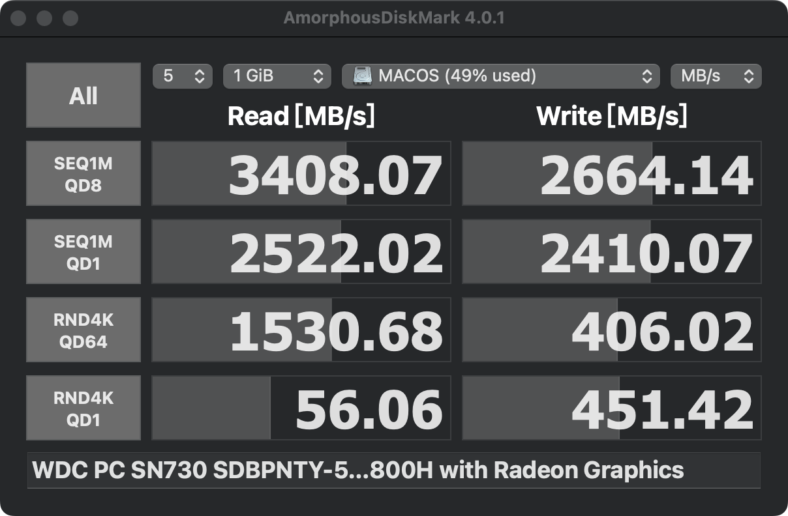

# Yoga14sACH2021_Hackintosh

Step-by-Step Guide on How to Install macOS on Yoga 14s ACH2021（手把手教你如何在yoga14s ACH2021上安装黑苹果）

# 电脑配置

|   规格   | 详细信息                                               |
| :------: | ------------------------------------------------------ |
| 电脑配置 | Yoga14sACH2021                                         |
| 操作系统 | Windows10 20H2 + MacOS Ventura                         |
|  处理器  | AMD Radeon Graphics 八核 7nm                           |
|   内存   | 16GB（三星 DDR4 3200MHz 8GB $\times$ 2）               |
|   主板   | 联想 LNYNB161216（AMD PCI 标准主机 CPU 桥）            |
|  主硬盘  | 西数 WDC PC SN730 SDBPNTY-512G-1101（512G / 固态硬盘） |
|   显卡   | AMD Radeon Graphic （2 GB / 联想）                     |
|  显示器  | 联想 LEN8A90（14英寸）                                 |
|   声卡   | 瑞旻 High Definition Audio                             |
|   网卡   | Intel Wi-Fi 6 AX200 1600MHz #2                         |
| 官方BIOS |                                                        |

# 完善度

测试环境 MacOS Ventura

| 功能           | 是否可用                          | MacOS    | 是否可用 |
| -------------- | --------------------------------- | -------- | -------- |
| 电源           | ✅                                 | iCloud   | ✅        |
| 蓝牙           | ✅                                 | 接力     | ✅        |
| 显示器亮度调节 | ✅                                 | 隔空投送 | ❌        |
| 无限网卡       | ✅                                 | 台前调度 | ✅        |
| 触摸板         | ✅                                 | 屏幕镜像 | ❌        |
| USB接口        | ✅                                 |          |          |
| 外放           | ✅                                 |          |          |
| 麦克风         | ✅                                 |          |          |
| 睡眠           | ✅(关盖睡眠需要时间以及唤醒很迅速) |          |          |

> ✅仅表示在正常使用环境下经过测试可以正常使用

# Geekbench 6比较

| 系统          | 项目 | 分数                                                         |
| ------------- | ---- | ------------------------------------------------------------ |
| Win 10        | CPU  | [Single-Core: 1930 Multi-Core: 7096](https://browser.geekbench.com/v6/cpu/10328820) |
| MacOS Ventura | CPU  | [SIngle-Core: 1542 Multi-Core: 7029](https://browser.geekbench.com/v6/cpu/10329321) |
| Win 10        | GPU  | [16674](https://browser.geekbench.com/v6/compute/3611974)    |
| macOS Ventura | GPU  | [13093](https://browser.geekbench.com/v6/compute/3611837)    |

# DiskMark比较

| 系统 | Win 10                                                       | MacOS Ventura                                                |
| ---- | ------------------------------------------------------------ | ------------------------------------------------------------ |
| 分数 |  |  |
| 工具 | AS SSD Benckmark                                             | AmorphousDiskMark                                            |

# 镜像制作以及安装工作

该项内容建议在网络中搜索进行学习，此项目中该部分并不完善。

请注意：数据无价, 谨慎操作！ 

## 磁盘分区

由于Yoga14s并不能进行扩容，所以请在D盘(或者其它非系统盘)中预留出MacOS的磁盘空间。

> 分区表为GUID格式。

## BIOS设置

开机按F2进去BIOS设置，关闭安全启动，保存并重启。

> BIOS的详细设置建议自行查询。

## 方案1 U盘安装（耗时长）

### 准备工作

- U盘一个(>=32G)
- 软件：balenaEtcher、DiskGenius
### U盘刻录

插入U盘，以管理员方式运行balenaEtcher，在界面中选择下载好的MacOS镜像(`.dmg`格式)以及U盘，点击`Flash`等待刻录完成即可。

### 安装MacOS系统

1、开机按F12，选择你刚刚刻录完成的U盘-回车，进入引导界面后选择`install MacOS`；

2、一段时间后会进入macOS实用工具界面，选择`磁盘工具`(注意先不选择安装macOS)，找到提前预留出的macOS安装位置并选中，点击抹掉并格式化为APFS格式~~(这里貌似可以设置系统的名称)~~，等待结束退出磁盘工具即可；

3、在主界面选择`安装macOS`，选择刚刚格式化的磁盘安装，之后一直点击`下一步/同意`，如果再次进去OC界面需要选择`MacOS`(不是之前1中选择的内容)，之后等待10-20分钟安装完成后进去MacOS激活界面，按照正常流程激活即可。

### 添加UEFI引导项{#first}

由于我们此时是从U盘引导进去Mac系统，我们还需要重新在电脑中建立引导，请参照[`方案2 恢复镜像安装 - 添加UEFI引导项`](#second)。 

### 替换EFI文件

打开`DiskGenuis`进入我们创建的`ESP分区`，删除目录下的`EFI`文件，并将项目中的EFI文件复制到该目录下，保存重启即可。

## 方案2 恢复镜像安装（速度快）

### 准备工作

- 软件：[DiskGenius](https://www.alipan.com/s/zUuvWzDcNC5)、[R-DriveImage](https://www.alipan.com/s/zUuvWzDcNC5)
- [MacOS恢复镜像(.rdr)](https://www.alipan.com/s/zUuvWzDcNC5)

### 配置磁盘

1、打开`DiskGenius`，找到你准备好的磁盘，点击菜单栏`分区-建立ESP/MSR分区`，勾选`建立ESP分区`和`对齐到此扇区数的整数倍`，分区大小填写300MB，取消勾选`建立MSR分区`，确认即可；

2、选中刚刚建立的ESP分区，把项目中的EFI文件复制到该分区。

> 如果提示需要格式化或者无法拷贝文件，则需要把该分区格式化为FAT32文件系统并指派一个驱动器号。

### 添加UEFI引导项{#second}

打开`DiskGenius`(如果熟悉操作也可以使用`EasyUEFI`或者`Bootice`，这里我们介绍`DiskGenius`)，在菜单栏选择`工具-制作UEFI引导项`，在弹出的窗口中选择`添加`，从ESP分区中找到`EFI-Boot-BOOTx64.efi`选中这个文件添加，并在右边的小窗口下方选择上移到最优先项，最后保存设置。

### 恢复镜像

1、打开`R-Drive Image`选择`恢复镜像`，选择之前下载好的`.rdr`文件，选择下一步，将`.rdr`文件拖动连接到开始准备好的磁盘，依次点击`下一步 - 启动`；

2、重启电脑，正常加载OC界面，进入MacOS完成安装设置即可。

## 测试兼容性

重启电脑后能够正常进入OC界面选择Win或者MacOS进入系统，接下来可以在MacOS中测试[各硬件兼容性](#完善度)。

## EFI配置说明

### Mac端修改

在MacOS安装`OpenCore-Configurator`，安装完成后打开，在右上任务栏点击图标并挂载EFI所在分区(需要输入Mac密码)，挂载完成可打开该分区并修改efi文件。

### Win段修改

仍然使用`DiskGenius`进去ESP分区修改保存即可。

> - [EFI各文件介绍1](https://yuexiang.fun/1231.html)
> - [EFI各文件介绍2](https://blog.xjn819.com/post/opencore-guide.html)

# 收尾工作

## 黑成白苹果

提醒：安装bootcamp可能会导致电脑上的exFAT分区被隐藏，并且可能无法修改，请注意提前备份。

### 目标

我们通过使用bootcamp达成不通过使用oc界面在win与mac之间进行切换。

### 安装

Bootcamp可以在google直接搜索下载，注意不同的系统对应不同的版本；下载完成后将文件放在任意你想放的位置，双击`setup.exe`进行安装；安装完成后运行。

### 切换

Win切换Mac：在任务栏右下角找到图标，右击`切换到MacOS`即可。
Mac切换Win：低版本mac可以在左上角找到`系统偏好设置--启动磁盘`，高版本mac在`设置-通用-启动磁盘`，在进入启动磁盘后选择Win所在盘点击`重新启动`即可（需要输入密码）。

### 关闭OC引导

在Win或者Mac中打开`config.plist`文件（打开方式可参照问题2），在`Misc`中取消勾选`Show Picker`，然后在`UEFI--UEFI驱动`中取消勾选`OpenCanopy.efi`，保存即可。

> bootcamp安装过程中常见问题：
> 1、运行`setup.exe`提示“版本不适用”：进入`driver--apple--bootcamp.msi`运行即可（如果提示仍然要从`setup.exe`进行安装请参照2）；
> 2、运行`setup.exe`提示“版本不适用”：在Win端用OCAT打开`efi--oc--config.conf`或者在Mac端用opencare打开相同文件，找到左侧`PI`、勾选`spoofvendor`、然后找到`UpdateSMBIOSMode`、选择 `creat`、然后找到`Kernel`、点击`选项`、然后把`CustomSMBIOSGuid `去掉勾选、保存、然后重新安装bootcamp，此时如果运行`setup.exe`提示缺少winpedrive之类的文件夹，在bootcamp同级文件夹下创建空文件夹即可；
>
> 3、如果安装bootcamp重启后D盘被隐藏：`Win+R`输入`cmd`进入命令行界面，在窗口内输入`DISKPART`按回车键并在新弹出的窗口输入`list volume`按回车键，命令行窗口中出现各磁盘详细属性(现在可以看到D盘信息显示已隐藏)，查看D盘对应的卷号(一般是在D盘所在行开头)，继续在命令行输入`select volume 1`，接着输入命令`attributes volume clear hidden`将其隐藏属性删除，如果此时提示`卷属性清楚成功`且重启后D盘正常显示即为设置成功(其它盘被隐藏可以类似处理)。
>
> 注意：Bootcamp的最高适配系统为Win10

## Windows、Mac文件互传

这是本项目中最为简单的部分，打开`DiskGenuis`，释放出一部分空间并将此空间格式化为`exFAT`格式、添加驱动器号。

> exFAT格式下的文件Windows和Mac都可读可写，如果有U盘经常在双系统下使用建议也格式化为exFAT格式。

## 使用部分联想管家功能

### [使用方式](https://github.com/daliansky/XiaoXinPro-13-hackintosh/issues/139#issue-970836873)

- 下载 [ECEnabler.kext](https://github.com/1Revenger1/ECEnabler/releases)
  - 得到 `ECEnabler.kext` 放入 `OC/Kexts` 并在 `config.plist` 中引入。
- 下载 `YogaSMC-App-Release.dmg`
  - 双击选择安装， 然后再双击安装 `YogaSMCPane.prefPane` 控制面板，安装后在 `系统偏好设置` 最后一行找到。
- 下载 [YogaSMC-Release.zip](https://github.com/zhen-zen/YogaSMC/releases)
  - 解压 得到 `YogaSMC.kext` 放入 `OC/Kexts` 并在 `config.plist` 中引入。
- 在 上面的 `YogaSMC-Release.zip` 中
  - 解压后同时会得到 `SSDTSample/*.dsl` ,
  - 使用 [MaciASL.app](https://github.com/acidanthera/MaciASL/releases) 分别打开 `SSDT-ECRW.dsl`、`SSDT-RCSM.dsl` ，
  - 不做任何修改，在 `文件`，选择 `另存为`，`文件格式`选择为：`ACPI xxx`,
  - 分别得到 `SSDT-ECRW.aml`、`SSDT-RCSM.aml` ，
  - 注意后缀是`.aml`，
  - 将它们放入 `OC/ACPI` 并在 `config.plist` 中引入。
- 重启生效。

### 生效功能

|        功能        |                    是否生效                     |
| :----------------: | :---------------------------------------------: |
| Fn功能键开启与关闭 |       ✅( 键盘上第一行的功能键几乎能工作 )       |
|  键盘灯启动与关闭  | ✅(`Fn+Space`可以进行切换，Pane中不可以进行切换) |
|    性能模式切换    |        ✅(`Fn+Q`不行，Pane中可以进行切换)        |
|     CapsLk 锁      |      ✅(单击用于切换键盘，长按可以锁定大写)      |

### 副作用

- ~~可能会导致`系统设置-键盘-键盘快捷键-修饰键`不能进行自定义~~
- ~~在Windows下切换性能模式可能会导致重启到Mac时Pane不能切换性能模式~~

 # 参考文档

- https://blog.xjn819.com/post/opencore-guide.html

- https://yuexiang.fun/1231.html

- https://github.com/daliansky/XiaoXinPro-13-hackintosh/issues/139#issue-970836873

- https://heipg.cn/tutorial/basic-install-hackintosh-walkthrough.html

- https://zhuanlan.zhihu.com/p/578312673

- https://hpglw.com/95d74e2e.html

# 鸣谢

[@黑成白苹果](https://m.tb.cn/h.TLeFr0V?tk=3Teieg6xuXt)

# 建议及声明

由于测试环境有限，部分功能在我的电脑下可以实现不代表适用于所有电脑；如有问题可以提交issues，不保证能够解决。

本项目仅用于学术研究与技术交流，任何因使用本项目代码或相关内容引发的法律责任或其他后果，作者不承担任何责任。

